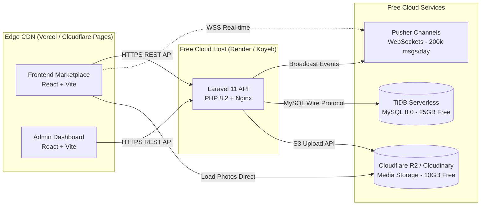

# Requirements

### Overview & Goals
The objective of this plan is to deploy the complete **Garage Parts Marketplace** platform online **100% free ($0.00 / month)** without requiring credit card commitments or ongoing subscription fees.

The deployment covers all 5 core architectural tiers:
1. **Frontend Marketplace (React + Vite)**: Public marketplace for buyers, sellers, and dealers.
2. **Admin Portal (React + Vite)**: Backoffice administration and moderation portal.
3. **Backend API (Laravel 11 / PHP 8.2+)**: REST API, Sanctum authentication, role policies, and business logic.
4. **Database (MySQL 8.0)**: Fully managed relational database for users, listings, parts, media, and favorites.
5. **Media Storage & WebSockets**: S3-compatible cloud photo storage and real-time messaging/notifications.

---

### 100% Free Platform Stack Matrix

| Component | Recommended Free Provider | Free Tier Allocation | Differentiator / Advantage |
|---|---|---|---|
| **Frontend Marketplace** | **Vercel** / **Cloudflare Pages** | Unlimited bandwidth & deployments | Automatic Git CI/CD, global edge CDN, free automatic SSL/TLS |
| **Admin Portal** | **Vercel** / **Cloudflare Pages** | Unlimited static hosting | Isolated admin subdomains with zero configuration |
| **Backend API** | **Render.com** or **Koyeb** | 750 free hours/month (Render) / 512MB RAM (Koyeb) | Native Docker/PHP runtime, custom domains, free SSL |
| **Managed Database** | **TiDB Cloud Serverless** | **25 GB storage**, 100M Request Units/mo | 100% MySQL 8.0 compatible, no migration changes needed |
| **Object Storage (Media)** | **Cloudflare R2** or **Cloudinary** | **10 GB storage**, $0 egress fees (R2) / 25GB (Cloudinary) | Direct S3 API compatibility with Laravel `Storage::disk('s3')` |
| **Real-time WebSockets** | **Pusher Channels Sandbox** | **200,000 messages/day**, 100 concurrent conns | Native Laravel Echo & Broadcasting integration, serverless |
| **Keep-Alive Uptime** | **UptimeRobot** / **Cron-Job.org** | 50 free monitors, 5-min intervals | Prevents Render free-tier cold starts by pinging health endpoint |

---

### Scope
- **In Scope**:
  - Full end-to-end setup guide with exact environment variable templates for all services.
  - Zero-cost architecture design connecting Frontend, Admin, Backend, TiDB MySQL, Cloudflare R2 / Cloudinary, and Pusher.
  - Production Dockerfile and Nginx configuration for containerized Laravel hosting.
  - Step-by-step deployment instructions for GitHub repository linking.
  - Automated uptime pinging strategy to eliminate cold start delays.
- **Out of Scope**:
  - Paid cloud infrastructure (AWS EC2/RDS, DigitalOcean Droplets, Google Cloud Compute).
  - Paid custom domain registrations (free default `*.vercel.app` and `*.onrender.com` domains will be used).

# Technical Design

### Current Architecture & Free Mapping



---

### Key Configuration Templates

#### 1. Backend Environment Variables (`backend/.env` in Render / Koyeb)
```env
APP_NAME="Garage Parts Marketplace"
APP_ENV=production
APP_KEY=base64:YOUR_GENERATED_APP_KEY_HERE
APP_DEBUG=false
APP_URL=https://garage-parts-api.onrender.com

# Frontend & Admin URLs (CORS & Sanctum)

FRONTEND_URL=https://garage-parts.vercel.app
ADMIN_URL=https://garage-parts-admin.vercel.app
CORS_ALLOWED_ORIGINS=https://garage-parts.vercel.app,https://garage-parts-admin.vercel.app

# Database: TiDB Serverless (MySQL 8)

DB_CONNECTION=mysql
DB_HOST=gateway01.ap-southeast-1.prod.aws.tidbcloud.com
DB_PORT=4000
DB_DATABASE=garage_parts
DB_USERNAME=your_tidb_user.root
DB_PASSWORD=your_tidb_password
MYSQL_ATTR_SSL_CA=/etc/ssl/certs/ca-certificates.crt

# Session & Cache

SESSION_DRIVER=cookie
SESSION_LIFETIME=120
CACHE_STORE=file
QUEUE_CONNECTION=database

# Media Storage: Cloudflare R2 (S3 Compatible)

FILESYSTEM_DISK=s3
AWS_ACCESS_KEY_ID=your_r2_access_key
AWS_SECRET_ACCESS_KEY=your_r2_secret_key
AWS_DEFAULT_REGION=auto
AWS_BUCKET=garage-parts-media
AWS_ENDPOINT=https://YOUR_ACCOUNT_ID.r2.cloudflarestorage.com
AWS_USE_PATH_STYLE_ENDPOINT=false
AWS_URL=https://media.yourdomain.com # or public R2 r2.dev URL

# Real-time WebSockets: Pusher Sandbox

BROADCAST_CONNECTION=pusher
PUSHER_APP_ID=your_pusher_app_id
PUSHER_APP_KEY=your_pusher_key
PUSHER_APP_SECRET=your_pusher_secret
PUSHER_APP_CLUSTER=ap1
```

#### 2. Frontend Environment Variables (`frontend/.env.production` on Vercel)
```env
VITE_API_URL=https://garage-parts-api.onrender.com
VITE_API_PREFIX=/api/v1
VITE_PUSHER_APP_KEY=your_pusher_key
VITE_PUSHER_APP_CLUSTER=ap1
```

#### 3. Admin Environment Variables (`admin/.env.production` on Vercel)
```env
VITE_API_URL=https://garage-parts-api.onrender.com
VITE_API_PREFIX=/api/v1
VITE_PUSHER_APP_KEY=your_pusher_key
VITE_PUSHER_APP_CLUSTER=ap1
```

---

### Backend Dockerfile (`backend/Dockerfile`)
```dockerfile
FROM php:8.2-fpm-alpine

# Install system dependencies & PHP extensions

RUN apk add --no-cache \
    nginx \
    curl \
    libpng-dev \
    libjpeg-turbo-dev \
    freetype-dev \
    libzip-dev \
    zip \
    unzip \
    ca-certificates \
    && docker-php-ext-configure gd --with-freetype --with-jpeg \
    && docker-php-ext-install pdo pdo_mysql gd zip bcmath opcache

# Install Composer

COPY --from=composer:2 /usr/bin/composer /usr/bin/composer

WORKDIR /var/www/html

# Copy application files

COPY . .

# Install dependencies and optimize

RUN composer install --no-dev --optimize-autoloader --no-interaction

# Permissions

RUN chown -R www-data:www-data /var/www/html/storage /var/www/html/bootstrap/cache

# Copy Nginx config & startup script

COPY ./docker-entrypoint.sh /usr/local/bin/docker-entrypoint.sh
RUN chmod +x /usr/local/bin/docker-entrypoint.sh

EXPOSE 80

CMD ["/usr/local/bin/docker-entrypoint.sh"]
```

---

### Zero-Cold-Start Keep-Alive Solution
On Render's free tier, backend web services sleep after 15 minutes of inactivity. To keep the API warm with instant response times:
1. Register a free account on **UptimeRobot** (or **Cron-Job.org**).
2. Create an **HTTP(s) Monitor** pointing to `https://garage-parts-api.onrender.com/api/v1/health`.
3. Set the monitoring interval to **10 minutes**.
4. Result: The free server stays continuously awake 24/7 without incurring any cost.

# Testing

### Validation Approach
Verification will be performed at each deployment stage to ensure cross-service connectivity and data integrity.

---

### Key Scenarios & Health Probes

1. **System Health Probe**:
   - `GET https://<backend-url>/api/v1/health`
   - Expected Output: `{"status": "ok", "app": "Garage Parts Marketplace", "database": "connected"}`.

2. **CORS & Multi-tenant Role Authentication**:
   - Register a new user (`POST /api/v1/auth/register`) from the Vercel frontend.
   - Verify `Access-Control-Allow-Origin` headers match the Vercel domain and Sanctum token is returned.

3. **Database CRUD & Migrations**:
   - Execute migrations on TiDB Cloud Serverless.
   - Fetch cars list (`GET /api/v1/marketplace/cars`) and parts list (`GET /api/v1/marketplace/parts`) confirming seeded/created database records load cleanly.

4. **High-Resolution Media Uploads (Cloudflare R2 / Cloudinary)**:
   - Create a listing with multiple image attachments from the frontend dropzone.
   - Verify images upload directly to cloud storage and are served publicly with HTTP 200.

5. **Saved & Favorites Wishlist Sync**:
   - Toggle heart favorite on vehicle and part cards.
   - Verify instant UI reflection and persistence in the TiDB `favorites` table.

6. **WebSocket Live Channel Sync**:
   - Open two browser tabs on the Vercel deployment.
   - Trigger a listing update or new part creation and verify live card updates via Pusher.

# Delivery Steps

### ✓ Step 1: Setup Free Cloud Database, Storage & WebSockets
Create and configure the free persistent database and object storage layers with zero hosting fees.

- Create a free **TiDB Cloud Serverless** instance (25 GB free MySQL 8.0-compatible storage) or **Aiven MySQL** free cluster.
- Retrieve the SSL connection credentials (`DB_HOST`, `DB_PORT`, `DB_DATABASE`, `DB_USERNAME`, `DB_PASSWORD`).
- Create a free **Cloudflare R2** bucket (10 GB free S3-compatible storage with $0 egress fees) or **Cloudinary** account.
- Generate R2 API tokens (Access Key ID and Secret Access Key) and configure the public bucket URL domain for media assets.
- Create a free **Pusher Channels** account (Sandbox tier: 200,000 free messages/day) to obtain WebSocket app credentials.

### ✓ Step 2: Deploy Laravel Backend API on Free Cloud Host
Containerize and deploy the Laravel 11 REST API to a free web hosting tier.

- Create a `Dockerfile` in `backend/` optimized for PHP 8.2+ FPM with Nginx/Caddy or deploy directly on **Render.com** (Free Web Service) / **Koyeb** (Free Eco tier).
- Configure backend production environment variables in the cloud dashboard (`APP_KEY`, `APP_URL`, `DB_*`, `FILESYSTEM_DISK=s3`, `AWS_*`, `BROADCAST_CONNECTION=pusher`, `PUSHER_*`, `CORS_ALLOWED_ORIGINS`).
- Execute database migrations and seeders (`php artisan migrate --force`, `php artisan db:seed --force`) against the live TiDB database.
- Verify health check endpoint at `https://<backend-app>.onrender.com/api/v1/health` returning HTTP 200 OK.

### * Step 3: Deploy Frontend Marketplace & Admin Portal on Vercel
Deploy both React Single Page Applications (Marketplace & Admin Portal) to edge CDNs with automatic SSL.

- Connect the GitHub repository to **Vercel** or **Cloudflare Pages** for the main marketplace (`frontend/` directory).
- Configure frontend build settings (`npm run build`, output: `dist`) and inject production environment variables (`VITE_API_URL`, `VITE_API_PREFIX`, `VITE_PUSHER_APP_KEY`, `VITE_PUSHER_APP_CLUSTER`).
- Connect the admin portal (`admin/` directory) to a separate Vercel/Cloudflare Pages deployment with its own environment variables.
- Update Laravel backend's `CORS_ALLOWED_ORIGINS` and `FRONTEND_URL` / `ADMIN_URL` with the assigned production Vercel domains.

###   Step 4: End-to-End Production Verification & Uptime Monitoring
Perform end-to-end integration testing across all platform capabilities in the live production environment.

- Test user registration and role-based login (`buyer`, `seller`, `dealer`, `parts_seller`, `admin`) with Sanctum token generation.
- Test vehicle build and part listing creation including high-resolution drag-and-drop media upload to Cloudflare R2 / Cloudinary.
- Test Saved & Favorites wishlist sync across marketplace listings and user account menus.
- Test real-time WebSocket broadcasting events when listings or favorites are updated.
- Configure a free uptime monitor (e.g., **UptimeRobot** or **Cron-Job.org**) to ping `GET /api/v1/health` every 10 minutes to prevent cold-start spin-downs on free backend tiers.